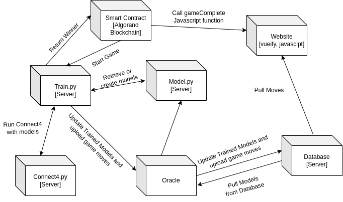

# S23_Battle_Bots

## Project Motivation
We are hoping to create a competitive connect4 bot betting circuit. Where users are encouraged to use their computing power and computer science to train intelligent AIs for a chance to win against other competitors.

## User Story
As a computer science major and an avid gambler I want to use my knowledge of AI to train my very own connect4 bot so I can win money by betting on the blockchain.

## Environment Setup
There are four compnents that must be set up in order to get our entire applicaiton to to get our system running.

### 1. Smart Contract

Prerequisites:
* A funded algorans account 
  1. You can generate accounts using betting/accounts.py if you do not have one already
  2. You can fund an account [here](https://testnet.algoexplorer.io/dispenser) 
* An API token like one from [purestake](https://www.purestake.com/)
To deploy the smart contract run the following command and record the apid it give you

`python betting/deploy_app.py <your private key> <algorand API endpoint> <API token>`

To to use betting/run.py to interact with the smart contract you must first populate it with some information

1. set your public and private keys to the pu_a and pr_a variables respectively.
2. set your API endpoint to the algod_endpoint variable. 
3. set the apid you recorded previously to the apd variable
4. set the adress of the app to the app_adress variable
  * the app's can be found at https://testnet.algoexplorer.io/application/<apid\>
5. set api token to the algorand_token variable

To interact with the smart contract you can use the following commands
`python betting/run.py pay <amount>`
Sends money to the your account in battle bots

`python betting/run.py create`
Creates a bot on your account 

`python run.py delete <bot id>`
Deletes the specified bot from your account

`python run.py transfer <bot id> <address>`
Transfer the specified bot from your account to another account

`python run.py withdrawal <amount>`
Withdrawal the specified amount from the smart contract

`python run.py bet <bot or not bot> <bet amount or bot to stake> <opponent's address> <bot to play with>`

### 2. Oracle

== ADD CONTENT HERE ==
> Account?

### 3. Q-Learning

== ADD CONTENT HERE ==

### 4. Website

In order to get the website component up & running running, the following commands, in order, must be run while in the root folder of our repository

`cd website/src`

`npm install` *(this may take a while)*

`npm run serve`

That's it! Now, your terminal should've provided you with two URLs to visit the working site. If you want to view the site on your own machine, paste the URL that's next to the ***Local*** section into your web browser; if you want to view the site on another machine that's on the same network as the host machine, paste the URL that's next to the ***Network*** section into that computer's web browser.

**== NOTE: Our site was made strictly for 16:9 apsect ratio. The website is neither re-size friendly nor mobile-friendly. ==**
